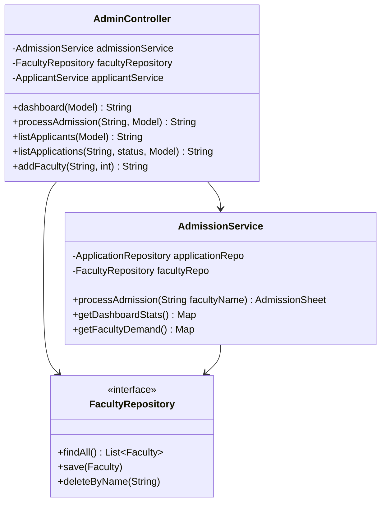

# ЗВІТ З НАВЧАЛЬНОЇ ПРАКТИКИ
## Лабораторна робота №12
### Тема: Проектування та розробка адміністративної частини інформаційної системи


---

### 1. Вступ
**Напрям дослідження:** Автоматизація процесів адміністрування в інформаційних системах, проектування баз даних та об'єктно-орієнтованих моделей.

**Мета роботи:** Розробити та спроектувати архітектуру адміністративної частини системи "Приймальна комісія", включаючи діаграму класів та модель бази даних.

**Завдання:**
1. Розробити діаграму класів адміністративної частини додатку.
2. Розробити модель БД адміністративної частини додатку.
3. Реалізувати функціонал керування факультетами, абітурієнтами та процесом зарахування.
4. Описати вхідні та вихідні дані системи.

---

### 2. Лаконічний опис результатів виконання
В ході лабораторної роботи було спроектовано та реалізовано адміністративний модуль системи. 

**Ключові компоненти:**
- **AdminController:** Центральний вузол обробки запитів адміністратора (керування списками, статусами, факультетами).
- **AdmissionService:** Сервіс бізнес-логіки, що відповідає за алгоритм автоматичного зарахування на основі середнього балу та квот.
- **DatabaseInitializer:** Механізм автоматичного розгортання схеми БД та наповнення її початковими даними.

**Основні можливості адміністратора:**
- Перегляд статистики подачі заявок.
- Керування переліком факультетів та їх обсягами (квотами).
- Моніторинг усіх абітурієнтів та поданих заявок.
- Запуск процедури зарахування (`processAdmission`) для конкретного факультету.

---

### 3. Діаграма класів та модель БД

#### 3.1. Діаграма класів адміністративної частини
Адміністративна частина базується на взаємодії контролера з сервісним шаром та репозиторіями:



#### 3.2. Модель БД адміністративної частини
База даних реалізована в MySQL. Адміністратор має повний доступ до всіх таблиць:

- **faculties**: Зберігає назву факультету та максимальну кількість місць (`max_students`).
- **applicants**: Дані абітурієнтів.
- **applications**: Зв'язок абітурієнтів з факультетами, включаючи статус (`PENDING`, `ADMITTED`, `REJECTED`).
- **users**: Облікові записи адміністраторів та користувачів з ролями.

---

### 4. Текст програми з коментарями

#### Реалізація адміністративного контролера (AdminController.java)
```java
@Controller
public class AdminController {
    // Впровадження залежностей через конструктор
    private final AdmissionService admissionService;
    private final FacultyRepository facultyRepository;
    
    // ...

    /** 
     * Обробка запиту на зарахування.
     * Викликає сервіс для виконання алгоритму відбору кращих абітурієнтів.
     */
    @PostMapping("/admission")
    public String processAdmission(@RequestParam String facultyName, Model model) {
        try {
            // Виклик бізнес-логіки зарахування
            AdmissionSheet sheet = admissionService.processAdmission(facultyName);
            
            // Формування відповіді для UI
            AdmissionResultResponse result = new AdmissionResultResponse(
                    facultyName,
                    ResponseMapper.toResponseList(sheet.getAdmitted()),
                    ResponseMapper.toResponseList(sheet.getRejected()));
            model.addAttribute("result", result);
        } catch (Exception e) {
            model.addAttribute("error", e.getMessage());
        }
        model.addAttribute("faculties", facultyRepository.findAll());
        return "admission";
    }

    /** 
     * Додавання нового факультету.
     * Дозволяє динамічно розширювати перелік напрямків підготовки.
     */
    @PostMapping("/admin/faculties/add")
    public String addFaculty(@RequestParam String name, @RequestParam int maxStudents) {
        facultyRepository.save(new Faculty(name, maxStudents));
        return "redirect:/admin/faculties";
    }
}
```

#### Ініціалізація структури БД (DatabaseInitializer.java)
```java
public class DatabaseInitializer {
    // SQL для створення таблиці факультетів
    private static final String CREATE_FACULTIES = """
            CREATE TABLE IF NOT EXISTS faculties (
                name VARCHAR(255) PRIMARY KEY,
                max_students INT NOT NULL
            )""";

    // SQL для створення таблиці заявок
    private static final String CREATE_APPLICATIONS = """
            CREATE TABLE IF NOT EXISTS applications (
                applicant_id VARCHAR(255) NOT NULL,
                faculty_name VARCHAR(255) NOT NULL,
                status VARCHAR(20) NOT NULL DEFAULT 'PENDING',
                PRIMARY KEY (applicant_id, faculty_name),
                FOREIGN KEY (applicant_id) REFERENCES applicants(id) ON DELETE CASCADE,
                FOREIGN KEY (faculty_name) REFERENCES faculties(name) ON DELETE CASCADE
            )""";
    
    // ...
}
```

---

### 5. Вхідні та вихідні дані програми

**Вхідні дані:**
- Назви нових факультетів та ліміти місць.
- Команди на зміну статусів заявок (ручне або автоматичне зарахування).
- Фільтри для перегляду списків (за факультетом, за статусом).

**Вихідні дані:**
- Оновлені статуси в базі даних.
- Сформований `AdmissionSheet` (відомість) з переліком зарахованих та відхилених осіб.
- Статистичні звіти про заповненість факультетів та попит на спеціальності.

---

### 6. Змістовний аналіз та висновки

**Аналіз результатів:**
Спроектована адміністративна частина забезпечує повний життєвий цикл управління вступною кампанією. Завдяки чіткому розділенню на шари (Controller -> Service -> Repository), система легко піддається розширенню. Наприклад, логіка зарахування в `AdmissionService` може бути змінена без впливу на веб-інтерфейс або структуру бази даних. Використання MySQL забезпечує цілісність даних через зовнішні ключі (Foreign Keys) з каскадним видаленням.

**Висновки:**
В ході виконання лабораторної роботи №12 було успішно розроблено архітектурні моделі та програмну реалізацію адміністративної панелі. Виконання завдань з проектування діаграми класів та моделі БД дозволило систематизувати структуру даних та зв'язків у системі. Реалізований функціонал відповідає вимогам до сучасних інформаційних систем управління навчальними закладами.
